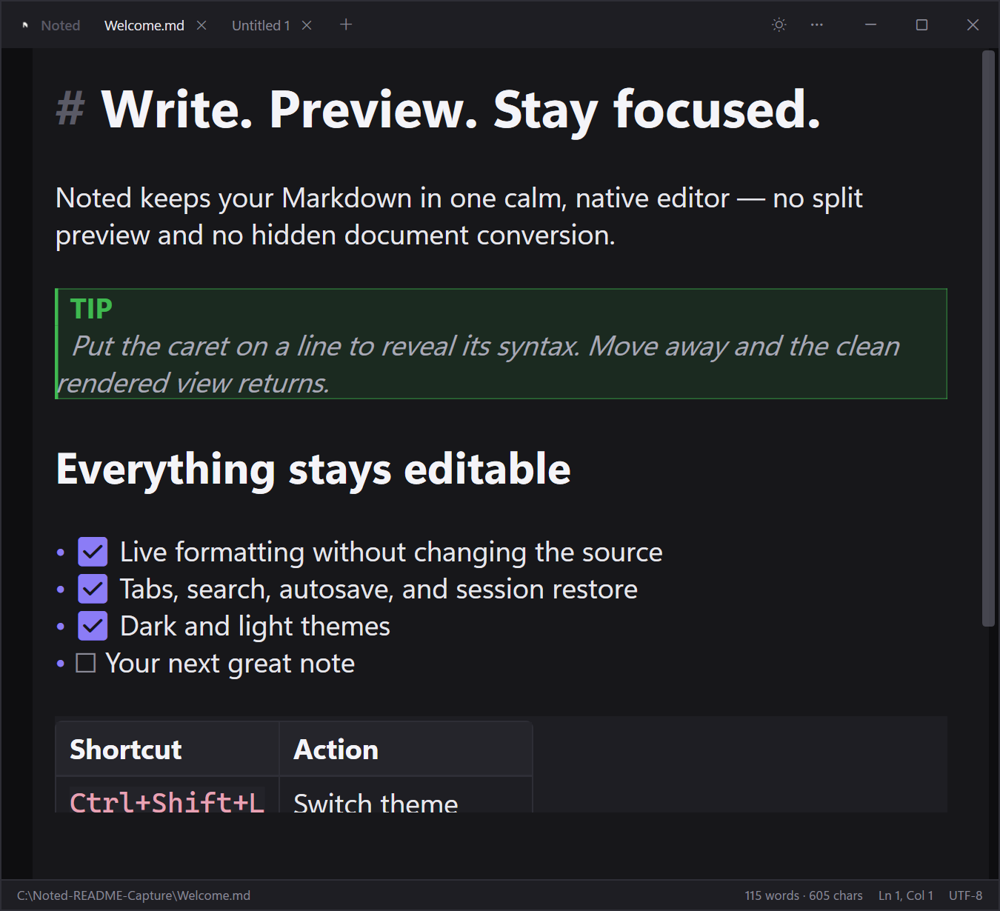
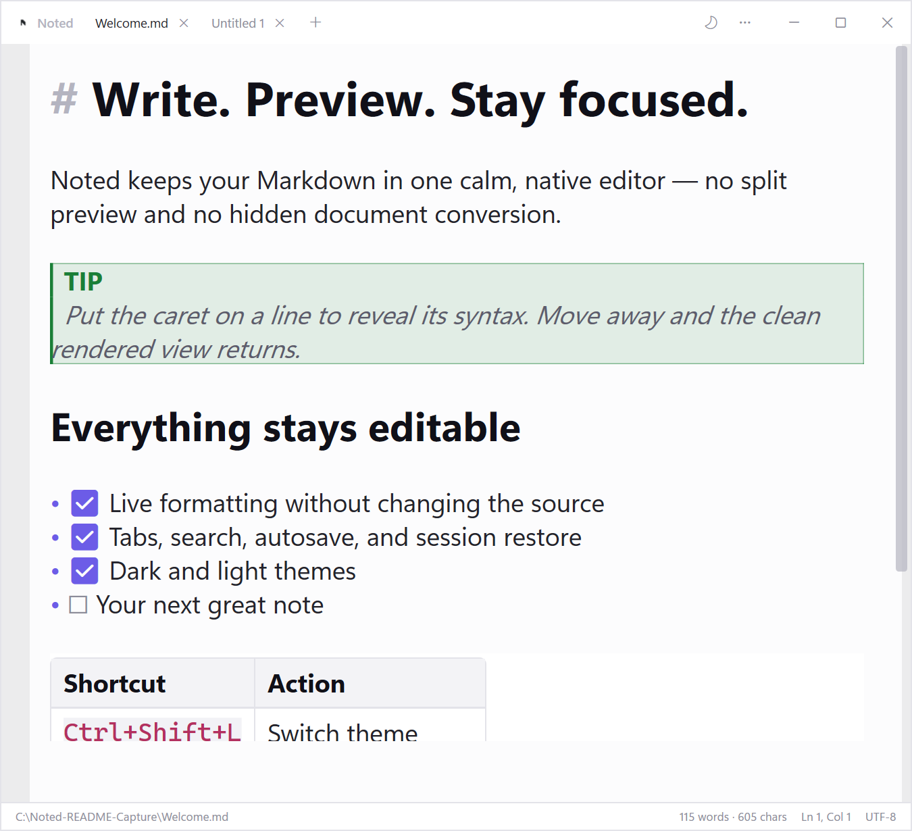

<div align="center">
  <picture>
    <source media="(prefers-color-scheme: dark)" srcset="assets/noted-wordmark-dark-transparent.png">
    <source media="(prefers-color-scheme: light)" srcset="assets/noted-wordmark-light-transparent.png">
    
  </picture>

  <p>A focused Windows notepad with live, inline Markdown rendering.</p>

  
  
  
  
</div>

<div align="center">
  
</div>

> [!NOTE]
> Noted is under active development. It is already usable, but behavior and appearance may continue to evolve.

## Overview

Noted behaves like Notepad—open a file, type, save—but Markdown is rendered directly inside the editor. There is no separate preview pane and the document is never transformed.

Move the caret onto a line and its raw syntax appears. Move away and the markers collapse again. What Noted saves is always exactly what you typed.

```text
## Heading          →   Heading
**bold** text       →   bold text
- [x] finished     →   ☑ finished
> quoted            →   ▏quoted
```

## Highlights

- **Live Markdown** — headings, emphasis, links, images, lists, tasks, quotes, tables, code fences, math, callouts, details blocks, mentions, tags, wiki-links, embeds, block references, comments, and more
- **A real text editor** — undo, search, selection, clipboard operations, and saved column positions continue to work because rendering never edits the underlying text
- **Tabs and recovery** — unsaved indicators, reopen-closed, session restore, and autosaved drafts for untitled notes
- **Comfortable reading** — a centered, resizable reading column, adjustable margins, word wrap, zoom, and optional line numbers
- **Personal themes** — dark and light modes plus configurable colors, fonts, heading styles, spacing, and grain texture
- **Windows-native behavior** — draggable custom title bar, snap layouts, maximize/restore, file drop, app icon, and MSI packaging
- **Encoding aware** — UTF-8 by default, with BOM and UTF-16 detection preserved when saving

## Screenshots

<table>
  <tr>
    <td align="center"><br><sub>Dark theme</sub></td>
    <td align="center"><br><sub>Light theme</sub></td>
  </tr>
</table>

Switch instantly with `Ctrl+Shift+L` or use the title-bar theme button.

## Keyboard shortcuts

| Action | Shortcut |
| --- | --- |
| New / open / save note | `Ctrl+N` / `Ctrl+O` / `Ctrl+S` |
| Find / replace / go to line | `Ctrl+F` / `Ctrl+H` / `Ctrl+G` |
| Switch theme | `Ctrl+Shift+L` |
| Toggle live Markdown | `Ctrl+Shift+P` |
| Settings / settings folder | `Ctrl+,` / `Ctrl+Shift+,` |
| Full screen | `F11` |
| Complete shortcut reference | `F1` |

Press `F1` inside Noted to open the full keyboard reference as a rendered note.

## Tech stack

| Technology | Role |
| --- | --- |
| [.NET 10](https://dotnet.microsoft.com/) | Runtime and build toolchain |
| [WPF](https://learn.microsoft.com/dotnet/desktop/wpf/) | Native Windows shell and interface |
| [AvalonEdit](https://github.com/icsharpcode/AvalonEdit) | Text editing engine |
| [WpfMath](https://github.com/ForNeVeR/WpfMath) | Inline and block math rendering |
| [WiX Toolset](https://wixtoolset.org/) | MSI installer packaging |
| xUnit | Scanner and analyzer tests |

## Run from source

### Requirements

- Windows 10 or Windows 11
- [.NET 10 SDK](https://dotnet.microsoft.com/download)

```powershell
git clone https://github.com/mohaneddz/Noted.git
cd Noted
dotnet run --project src/Noted
```

Open a file directly by passing its path:

```powershell
dotnet run --project src/Noted -- "C:\Notes\example.md"
```

Files can also be dragged onto the running window.

## Build the installer

```powershell
build\build-installer.ps1
```

The script publishes Noted and creates `build\Noted-Setup.msi`. The installer provides Start Menu and Desktop shortcuts, an Add/Remove Programs entry, upgrade support, and the application icon throughout.

The package is framework-dependent, so the target machine needs the .NET 10 Windows Desktop Runtime. The build script installs the WiX CLI automatically on its first run if necessary.

## Test

```powershell
dotnet test
```

The tests cover the Markdown scanner and cross-line analyzer—the pieces most likely to create subtle rendering errors.

## How live preview works

Noted keeps one real AvalonEdit document on screen and layers presentation behavior over it:

| Component | Responsibility |
| --- | --- |
| [`MarkdownScanner`](src/Noted/Markdown/MarkdownScanner.cs) | Tokenizes each line into content and marker spans |
| [`MarkdownAnalyzer`](src/Noted/Markdown/MarkdownAnalyzer.cs) | Caches results and tracks cross-line blocks |
| [`MarkdownColorizer`](src/Noted/Rendering/MarkdownColorizer.cs) | Applies typography and colors |
| [`MarkdownElementGenerator`](src/Noted/Rendering/MarkdownElementGenerator.cs) | Collapses syntax markers and substitutes visual glyphs |
| [`BlockDecorationRenderer`](src/Noted/Rendering/BlockDecorationRenderer.cs) | Draws panels, quote bars, rules, and language tags |
| [`RevealTracker`](src/Noted/Rendering/RevealTracker.cs) | Reveals syntax around the caret or selection |

Syntax is hidden with zero-width visual elements rather than deleting or replacing text. Undo, search, save, selection, and cursor positions therefore continue to operate on the original Markdown.

## Project structure

```text
src/Noted/
├── Editing/          formatting and line operations
├── Infrastructure/   prompts, commands, and shortcut reference
├── Markdown/         scanner, analyzer, and document model
├── Models/           open-note state and encoding
├── Rendering/        live preview and visual elements
├── Services/         persistent application settings
├── Settings/         settings window
└── Themes/           WPF styles

tests/Noted.Tests/    scanner, analyzer, and reveal tests
assets/               source branding assets
build/                installer sources and build scripts
screenshots/          README captures
```

## Settings and local data

Settings are stored at `%APPDATA%\Noted\settings.json`. Untitled-note drafts and pasted-image data are kept under the same directory. Noted works locally and does not require an account or hosted service.

The Settings window exposes appearance, colors, heading styles, layout, spacing, editor behavior, autosave, and visual effects without requiring a restart.

## Contributing

1. Fork the repository.
2. Create a focused branch.
3. Make the change and run `dotnet test`.
4. Open a pull request describing the behavior and verification performed.

Bug reports and small, focused improvements are welcome.
